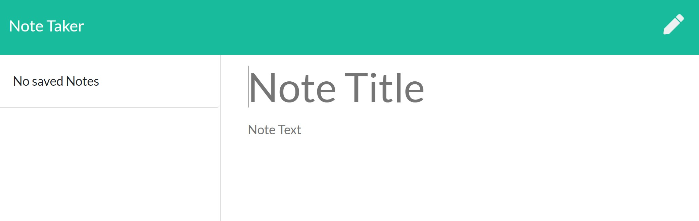

# NoteTaker

## Description
This application can be used to write, save, and delete notes. This application uses an express backend to save and retrieve note data from a JSON file.

## Deployed app
This is app is deployed to Heroku:
https://notetaker-smcguinn.herokuapp.com/

## Questions
Please feel free to contact me with any questions about this app.

Name: Sara McGuinn

GitHub: saramcguinn

Email: sara.mcguinn@gmail.com

